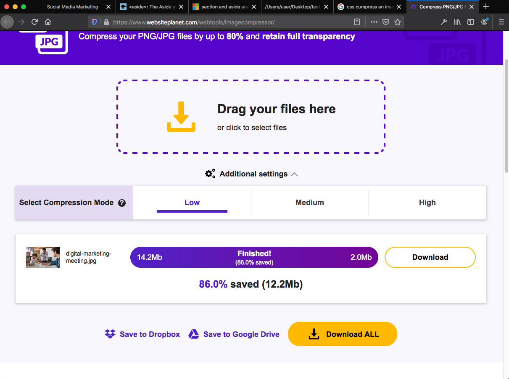

# Social-Media-Marketing

Social Media and Marketing website

## Aim of the website upgrade

The marketing agency where I work has been given the task from a client to upgrade their website
to follow accessibility standards to optimized search engines. It is very crucial that the html stucture
of the page is updated so that it falls in line with the proper html semantics.

## What tasks were carried out

There were several changes made to the structure of the html on the index.html page such as:

- div id main was added to represent the main body of the webpage. The within the main other tag elements were added such as:

- div id="container" : It was added to provide more stylings to the page since while changes were being made with the html contents
  the css styles of the page was being broken.

- aside class="benefits": It was added to the section of page contents that was on the right hand side of the page. As the section of page contens was seperate from the main content it was seen as the best assign the <aside> tag to it.

-<alt tags> has been added to every images on the website.

-css floats which was in the image elements have been removed from the html file and has been placed in the css files under their respective image tags.

Another important change that was the compression of the hero image. It was was big file of 14.2Mb and this file size was really huge
and was having an impact on the loading of the webpage. An online compression website (https://www.websiteplanet.com/webtools/imagecompressor/)was used and this result in a significant reducement in the file size, from 14.2Mb to 2.0Mb. A screenhot of the file compression has been added to:

## The website's live deployment

The website has reached its final stage and has been uploaded to GitHub for live deployment. Its web address is: 

